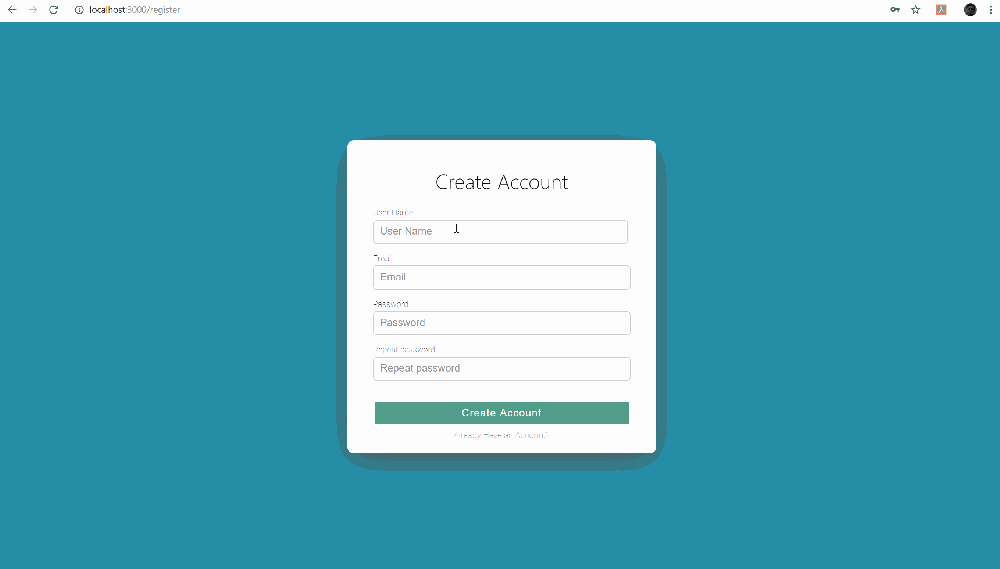
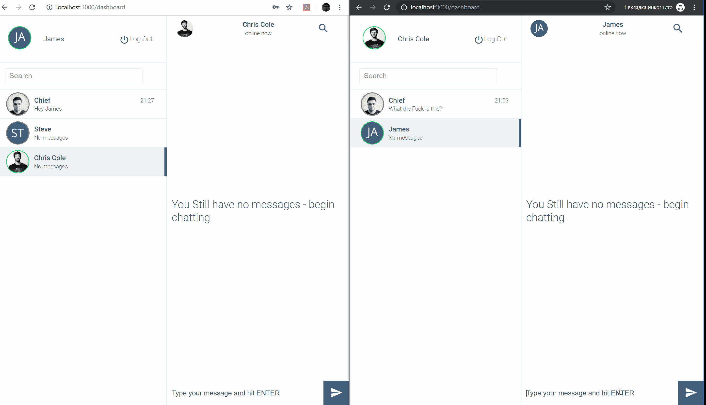
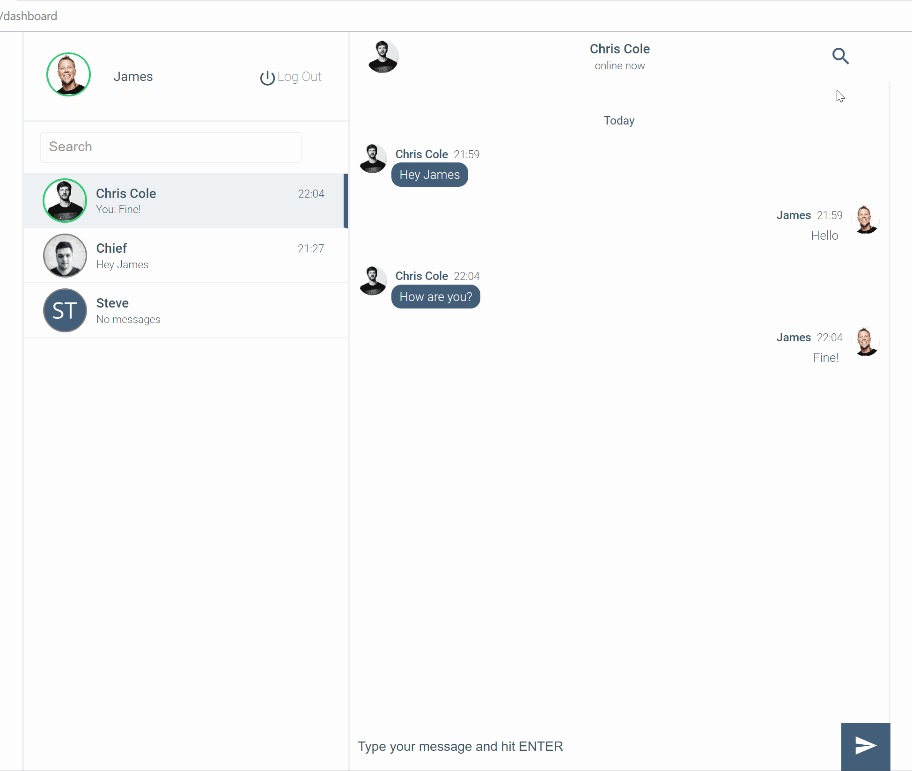

# WebChat
WebChat using .NET Core, SignalR, Rest API, React JS, HTML/CSS, CSS Grid, MS SQL
## Features
* Register/Login
* User search
* Creating threads
* Direct chatting
* Typing notification
* Online/Offline status notification
* Default avatar/upload personal image avatar
* Last message and threads sortig by last message
* Last message time dispay format Today, Yesterday, Up to 6 days ago, Week Ago, if more showing day and month.
* On chat bubble hover showing time when message was send.
* Change email and password
* Scroll to the last message in thread
### Todo: 
* Responsive design
* new message stickers notification
* Add group chatting
* Unit Tests
## How to use?
You can clone the repo to your local machine. At VS run the backend with hardcoded port 5000, same with front end, open clien folder at VS Core and restore all npm dependencies, then just npm run. By default it runs on port 3000. 
>Register and Login with JWT Token | Validations BackEnd and FrontEnd
>

>Seacrh for registered users and creating thread
>

>Handling connection status, showing online/offline statuses for each registered user, not only connection with connectin mapper implemented on backend
>

>Direct messages and avatar uploader with connected clients notification
>

>Search for messages in curent thread directly from API
>
